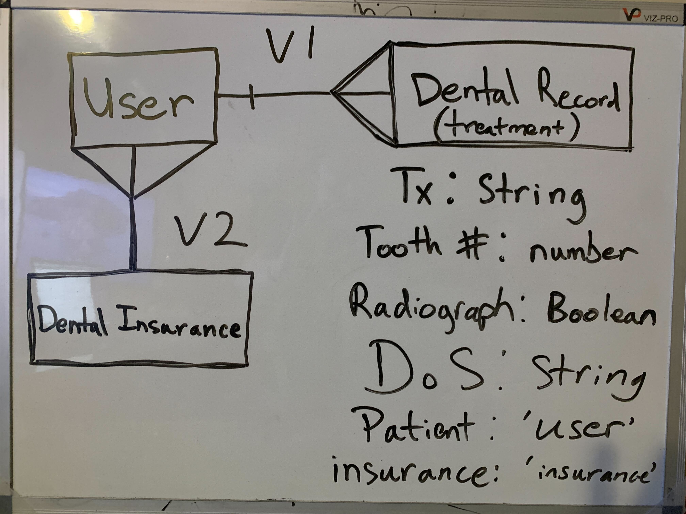
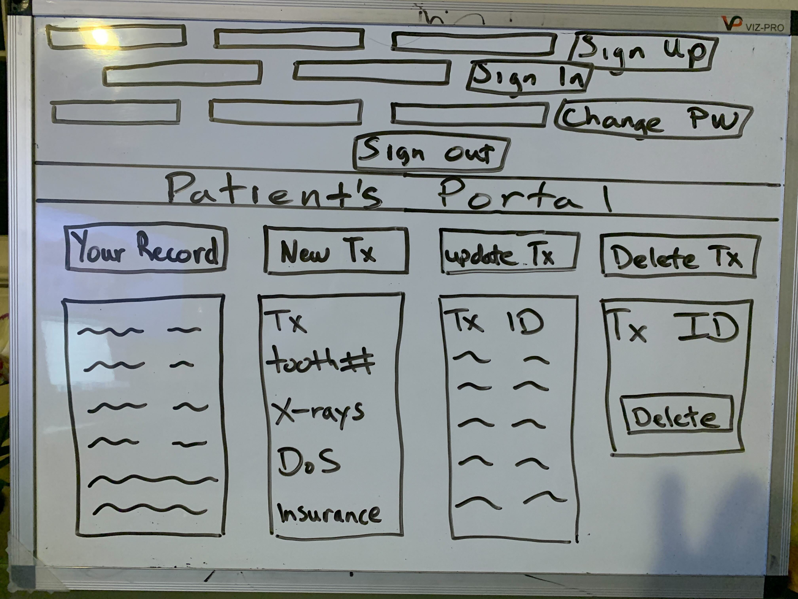

# My Dental Record: Logging and referencing your personal dental records

As a former registered dental hygienist, I know how important it is to have a record of all of your past dental treatment. This free application will help users, or in this case patients, create an account and log of of their dental treatment for future references. This application will help users as references when they want to:

- Dispute a treatment or payment of a treatment with their dental provider.
- Settle a treatment or the payment of the treatment with their insurance.
- Have a collective record for all of their dental treatments from different dental providers.

## Important Links

- [My Dental Records](https://hieppie.github.io/myDentalRecord-client/)
- [API Repo](https://github.com/hieppie/myDentalRecord-api)
- [Deployed API](https://lit-depths-28771.herokuapp.com/)

## Planning

### User Stories
- As a new user I want to be able to sign up for a free account and be notified if the sign up is a success or failure.
- As a returning user I want to be able to sign in and be notified if the sign in is a success or failure.
- As a user I want to be able Create or log a new treatment and save it into my record.
- As a user I want to be able to Read or view my and only my record of all of my treatments. No other   user should be able to see my records and I should not be able to see theirs due to HIPPA. 
- As a user I want to be able to Read or show a treatment with the the treatment ID provided. 
- As a user I want to be able to Update or edit a treatment information. 
- As a user I want to be able to Delete a treatment. 
- As a signed in user I want to be able to sign out and be notified if the sign out is a success.

## Technologies Used
 -  HTML/CSS
 -  Bootstrap
 -  JQuery
 -  AJAX
 -  Javascript
 -  MongoDB/Mongoose
 -  Express API

## Entity Relationship Diagram (ERD):

## Wireframe:

## Reference Links

  - Images
  [Toothbrushes](https://images.unsplash.com/photo-1607613009820-a29f7bb81c04?ixlib=rb-1.2.1&ixid=MnwxMjA3fDB8MHxwaG90by1wYWdlfHx8fGVufDB8fHx8&auto=format&fit=crop&w=2080&q=80)

  - Font
 [Fjord One](https://fonts.google.com/specimen/Fjord+One)
